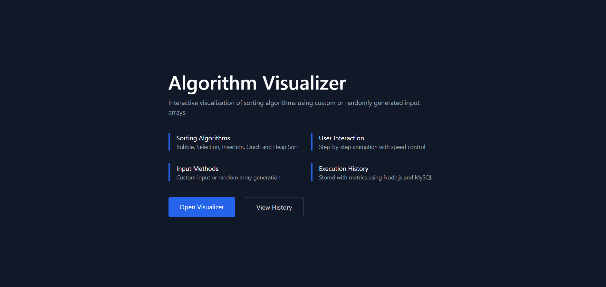
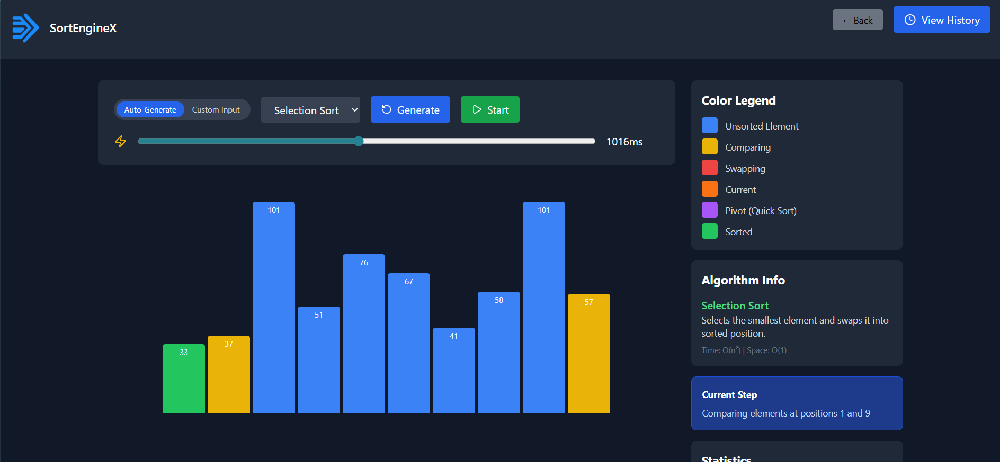
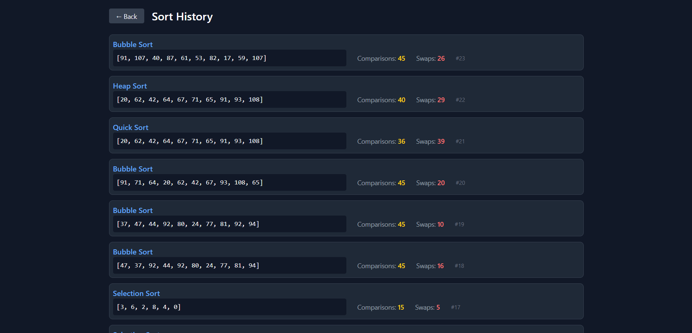

# Algorithm Visualizer (SortEngineX)

An interactive sorting-algorithm visualizer with step-by-step animation and a “history” page that stores runs in MySQL.

## Features

- Visualize: Bubble, Selection, Insertion, Quick, Heap sort
- Step-by-step animation with speed control
- Save recent runs (algorithm + input + metrics) and view them in History

## Tech Stack

- Frontend: React + Vite + Tailwind CSS
- Backend: Node.js + Express + MySQL (mysql2)

## Screenshots

Add your screenshots here:

1. Landing page: `docs/screenshots/landing.png`
2. Visualizer page: `docs/screenshots/visualizer.png`
3. History page: `docs/screenshots/history.png`

Example markdown (keep these after adding real images):





## Local Setup

### 1) Create the MySQL database + table

The backend expects a database named `sort_engine` and a table named `sort_history`.

Run this in MySQL:

```sql
CREATE DATABASE IF NOT EXISTS sort_engine;
USE sort_engine;

CREATE TABLE IF NOT EXISTS sort_history (
  id INT AUTO_INCREMENT PRIMARY KEY,
  algorithm VARCHAR(50) NOT NULL,
  input_array TEXT NOT NULL,
  array_size INT NOT NULL,
  comparisons INT NOT NULL DEFAULT 0,
  swaps INT NOT NULL DEFAULT 0,
  created_at TIMESTAMP NOT NULL DEFAULT CURRENT_TIMESTAMP
);
```

### 2) Start the backend

From the project root:

```powershell
cd backend
npm install
npm run start
```

Backend runs on `http://localhost:3000`.

> Note: MySQL credentials are currently hardcoded in `backend/db.js` (user `root`, empty password, host `localhost`).
> For anything beyond local development, switch to environment variables.

### 3) Start the frontend

In a second terminal:

```powershell
cd frontend
npm install
npm run dev
```

Frontend runs on Vite’s default port (typically `http://localhost:5173`).

## Run Checklist

- Backend is running on port `3000`
- MySQL is reachable and `sort_history` table exists
- Open the frontend and go to `/visualizer`

## Project Structure

- `frontend/` - React app (UI + animation)
- `backend/` - Express API (sorting endpoint + MySQL history)
- `backend/algorithms/sorting.js` - Sorting implementations that generate animation steps

